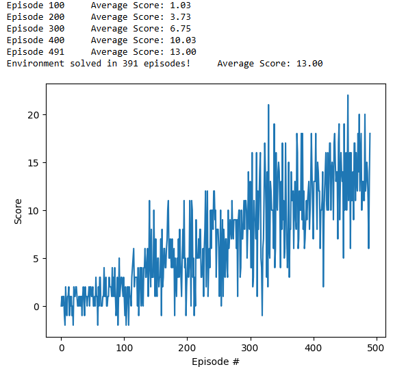

## Description of the Learning Algorithm

The agent is trained using the Deep Q-Learning (DQN) algorithm. This approach leverages a replay memory buffer to store experiences, which are sampled uniformly to break the correlation between consecutive steps and stabilize training. At each learning step, the agent uses a randomly sampled mini-batch of experiences from this buffer to update the Q-network.

## Hyperparameters
- Mini-batch size: 64
- Replay buffer size: 10,000
- Discount factor (γ): 0.99
- Soft update factor (τ): 0.01
- Lerning rate: 0.001
- Agent history length: 4
- Initial exploration rate (ε): 1.0
- Final exploration rate (ε_min): 0.01
- Exploration decay rate: 0.995

# Model Architecture
- Input Layer: A 37-dimensional feature vector representing the agent's velocity and ray-based perception in the forward direction.

- Hidden Layer 1: Fully connected layer with 64 ReLU (Rectified Linear Unit) activation units.

- Hidden Layer 2: Fully connected layer with 64 ReLU activation units.

- Output Layer: Fully connected linear layer producing 4 outputs, corresponding to the Q-values for each of the 4 possible actions.

# Plot of Rewards

The agent successfully solved the environment by achieving an average score greater than 13.0 over 100 consecutive episodes, completing this milestone in 393 episodes.

# Future Improvements

- Implement Double DQN : Reduces the overestimation bias of Q-values by decoupling action selection from action evaluation during target calculation.

- Use Prioritized Experience Replay : Samples more informative experiences (e.g., with high TD error) more frequently, improving sample efficiency and learning speed.

- Design a Deeper Neural Network : Increasing the depth or width of the neural network may allow the agent to better capture complex patterns in the environment.

- Incorporate Dueling DQN Architecture : Separating the estimation of state-value and advantage functions can lead to more stable learning, especially in environments where some actions do not affect the outcome significantly.

- Experiment with Reward Normalization or Clipping Techniques : Stabilizes learning by maintaining consistent reward scales across different states and episodes.