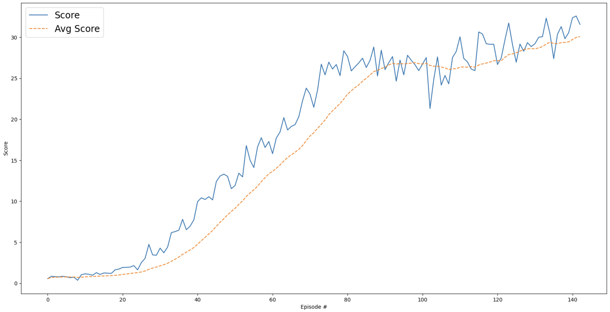

# Description of the Learning Algorithm
This project implements the Deep Deterministic Policy Gradient (DDPG) algorithm — an actor-critic, model-free reinforcement learning method designed for environments with continuous action spaces. In this setup, 20 parallel agents are used to collect diverse experiences simultaneously, while a single shared actor-critic network is updated at a fixed interval defined by UPDATE_RATE, improving training efficiency and stability.

- Actor-Critic Architecture
    - Actor Network: learns a deterministic policy to map states to continuous actions.
    - Critic Network: learns to estimate Q-values  Q(s,a) for state-action pairs.
- Target Networks :
Soft-updated copies of the actor and critic networks that stabilize learning by slowly tracking the learned networks.
- Experience Replay Buffer : 
Stores experience tuples (s,a,r,s′,d) and samples mini-batches to break correlation and improve data efficiency.
- Ornstein-Uhlenbeck Noise :
Adds time-correlated exploration noise to actions during training to encourage exploration in continuous spaces.
- Epsilon Decay :
Exploration noise is scaled by an ε value that decays over time, gradually reducing exploration as learning progresses.


The training loop follows a structured sequence to optimize the agent's policy. First, the agent interacts with the environment by selecting actions using the actor network, with added noise to encourage exploration. The resulting experiences—comprising states, actions, rewards, next states, and done flags—are stored in a shared replay buffer. At every defined interval (UPDATE_RATE steps), the agent samples a batch of experiences from this buffer to learn. The critic network is updated by minimizing the mean squared error between the predicted Q-values and the target Q-values computed using the Bellman equation. Simultaneously, the actor network is updated by maximizing the expected Q-values of the actions it proposes. To stabilize learning, soft updates are applied to the target networks, allowing them to gradually follow the weights of the local networks. This process is repeated over multiple episodes, during which the exploration noise decays and the agent's policy becomes progressively more refined.

# Hyperparameters
- BUFFER_SIZE = int(1e5)
- BATCH_SIZE = 128
- GAMMA = 0.99
- TAU = 1e-3
- LR_ACTOR = 1e-4
- LR_CRITIC = 1e-3
- WEIGHT_DECAY = 0
- UPDATE_RATE = 2  (the rate at which the network is updated. For every 2 data collection, the network is updated once)
- n_episodes = 500
- max_t	Maximum = 100 (number of timesteps per episode)
- print_every = 20 	(Number of episodes for calculating the average score value (sliding window)

# Model Architecture

### Actor Model :
Purpose: Maps observed states to continuous actions — it defines the policy π(s).

The Actor network maps a 33-dimensional state input to a 4-dimensional continuous action output using three fully connected layers (300 → 200 → 4), with Layer Normalization applied after the first layer to stabilize training.
```
 Actor(
  (fc1): Linear(in_features=33, out_features=300, bias=True)
  (ln1): LayerNorm((300,), eps=1e-05, elementwise_affine=True)
  (fc2): Linear(in_features=300, out_features=200, bias=True)
  (fc3): Linear(in_features=200, out_features=4, bias=True)
)
```

### Critic Network :

Purpose : Evaluates the value  Q(s,a)of a state–action pair — the value function.

The Critic network estimates Q-values by first processing the 33-dimensional state input through a fully connected layer (300 units) with Layer Normalization, then concatenating the action input and passing it through two more layers (304 → 200 → 1) to output a scalar value.

```
Critic Model:
 Critic(
  (fcs1): Linear(in_features=33, out_features=300, bias=True)
  (ln1): LayerNorm((300,), eps=1e-05, elementwise_affine=True)
  (fc2): Linear(in_features=304, out_features=200, bias=True)
  (fc3): Linear(in_features=200, out_features=1, bias=True)
)
```
# Plot of Rewards
The agent successfully solved the environment by achieving an average score greater than 30.7 over 143 episodes.


# Future Improvements

-  Switch to TD3 (Twin Delayed DDPG) - TD3 is a direct improvement over DDPG and addresses its instability by adding a second critic to reduce overestimation bias and delaying actor updates (e.g., update actor every 2 critic updates).

- Use Prioritized Experience Replay : Samples more informative experiences (e.g., with high TD error) more frequently, improving sample efficiency and learning speed.

