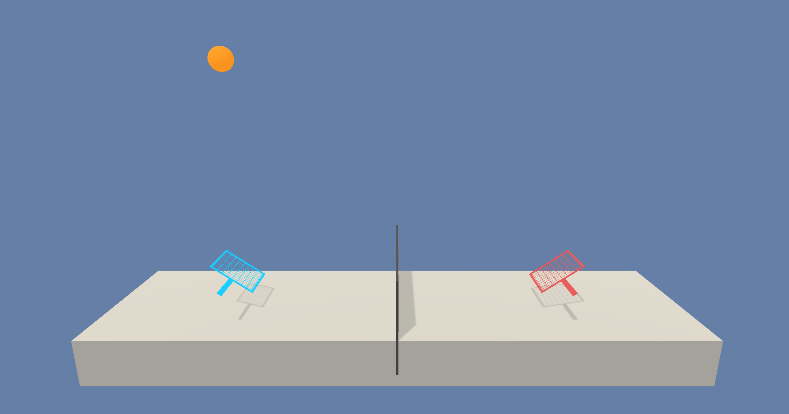

# Udacity DRL - Project 3: Continuous Control
### Introduction

The objective of the agents is to learn and keep the ball going back and forth, earning a high score by working together.

### The environment
In this environment, two agents control rackets to bounce a ball over a net. If an agent hits the ball over the net, it receives a reward of +0.1. If an agent lets a ball hit the ground or hits the ball out of bounds, it receives a reward of -0.01. Thus, the goal of each agent is to keep the ball in play.

The observation space consists of 8 variables corresponding to the position and velocity of the ball and racket. Each agent receives its own, local observation. Two continuous actions are available, corresponding to movement toward (or away from) the net, and jumping.

### Solving Criteria

The task is episodic, and in order to solve the environment, your agents must get an average score of +0.5 (over 100 consecutive episodes, after taking the maximum over both agents). Specifically,

After each episode, we add up the rewards that each agent received (without discounting), to get a score for each agent. This yields 2 (potentially different) scores. We then take the maximum of these 2 scores.
This yields a single score for each episode.
The environment is considered solved, when the average (over 100 episodes) of those scores is at least +0.5.

### Installation
1. Clone the Course Repository and set up the Python environment instructions in the DRLND GitHub repository.

2. Download the Unity environment:

- [Linux](https://s3-us-west-1.amazonaws.com/udacity-drlnd/P3/Tennis/Tennis_Linux.zip)
- [Mac OSX](https://s3-us-west-1.amazonaws.com/udacity-drlnd/P3/Tennis/Tennis.app.zip)
- [Windows 32-bit](https://s3-us-west-1.amazonaws.com/udacity-drlnd/P3/Tennis/Tennis_Windows_x86.zip)
- [Windows 64-bit](https://s3-us-west-1.amazonaws.com/udacity-drlnd/P3/Tennis/Tennis_Windows_x86_64.zip)

3. Place the unzipped folder from step 2 in p3_collab-compet folder (the DRLND GitHub repository).

### How to run the code
You can train and test the agent using the Tennis.ipynb notebook. Follow the instructions provided in the notebook to adjust the hyperparameters as needed
