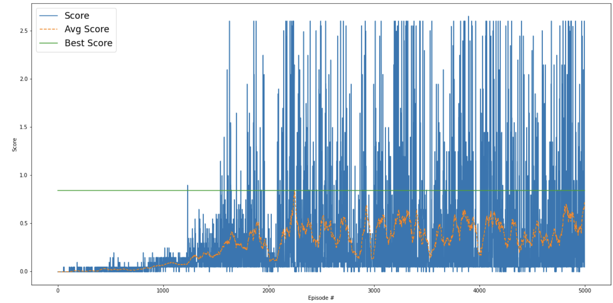

# Description of the Learning Algorithm
This project implements a coordinated multi-agent DDPG loop, using MADDPG in a continuous environment.

This algorithm trains two agents to cooperate in a continuous action environment using the MADDPG (Multi-Agent Deep Deterministic Policy Gradient) approach. Each agent is a DDPG agent with its own actor and a centralized critic that sees the full environment state and all agent actions. At every step, agents select actions with added noise for exploration, step the environment, and store their experiences in a shared replay buffer. Once enough experiences are collected, each agent samples from the buffer and updates its networks using gradients from its own data, but leveraging global state/action information for its critic.

Training continues until the average score across recent episodes surpasses a target threshold, at which point the environment is considered solved. To achice an average scope of 0.5, I set the traget to 1.0. This helps the agent to avhiev a better result by continue training.


# Hyperparameters
- BUFFER_SIZE = int(1e5)
- BATCH_SIZE = 128
- GAMMA = 0.95
- TARGET_SCORE = 1.0 (the minimum required score is 0.5)
- TAU = 1e-3
- LR_ACTOR = 1e-4
- LR_CRITIC = 1e-3
- WEIGHT_DECAY = 0
- n_episodes = 5000
- print_every = 50 	(Number of episodes for calculating the average score value (sliding window)

# Model Architecture

### Actor Model :
Purpose: Maps observed states to continuous actions — it defines the policy π(s).

The Actor network maps a 24-dimensional state input to a 2-dimensional continuous action output using three fully connected layers (300 → 200 → 2), with Layer Normalization applied after the first layer to stabilize training.
```
 Actor(
  (fc1): Linear(in_features=24, out_features=300, bias=True)
  (ln1): LayerNorm((300,), eps=1e-05, elementwise_affine=True)
  (fc2): Linear(in_features=300, out_features=200, bias=True)
  (fc3): Linear(in_features=200, out_features=2, bias=True)
)
```

### Critic Network :

Purpose : Evaluates the value  Q(s,a)of a state–action pair — the value function.

The Critic network estimates Q-values by first processing the 48-dimensional state input through a fully connected layer (300 units) with Layer Normalization, then concatenating the action input and passing it through two more layers (304 → 200 → 1) to output a scalar value.

```
Critic Model:
 Critic(
  (fcs1): Linear(in_features=48, out_features=300, bias=True)
  (ln1): LayerNorm((300,), eps=1e-05, elementwise_affine=True)
  (fc2): Linear(in_features=304, out_features=200, bias=True)
  (fc3): Linear(in_features=200, out_features=1, bias=True)
)
```
# Plot of Rewards
The plot show the learning process of the agents in the Tennis environment. Early on, both the raw and average scores are near zero, as expected. After 1000–2000 episodes, you see a clear upward trend in both raw and average scores. Eventually, the average score crosses the “solved” line and hovers around it.
The raw scores become very volatile, but the average  is what matters for the project to be considered solved (episode 4800 - 4900 and multiple other episodes shows the average is >0.5 over 100 consecutive episodes).


# Future Improvements

-  Switch to TD3 (Twin Delayed DDPG) - TD3 is a direct improvement over DDPG and addresses its instability by adding a second critic to reduce overestimation bias and delaying actor updates (e.g., update actor every 2 critic updates).

- Use Prioritized Experience Replay : Samples more informative experiences (e.g., with high TD error) more frequently, improving sample efficiency and learning speed.
